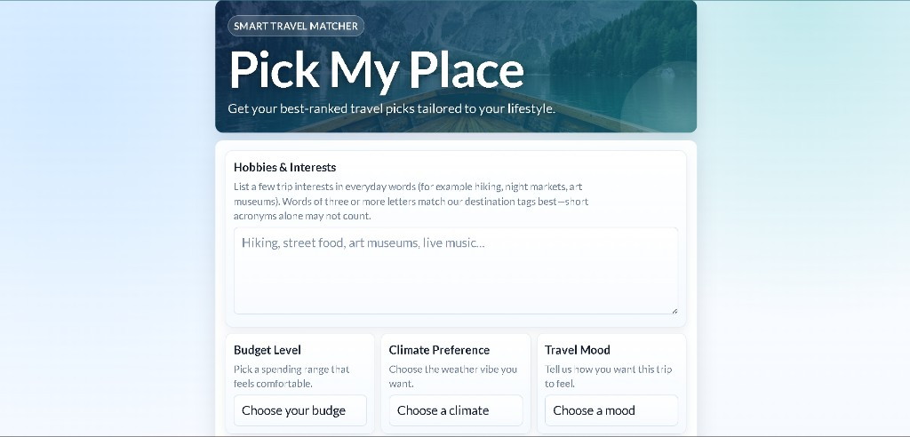
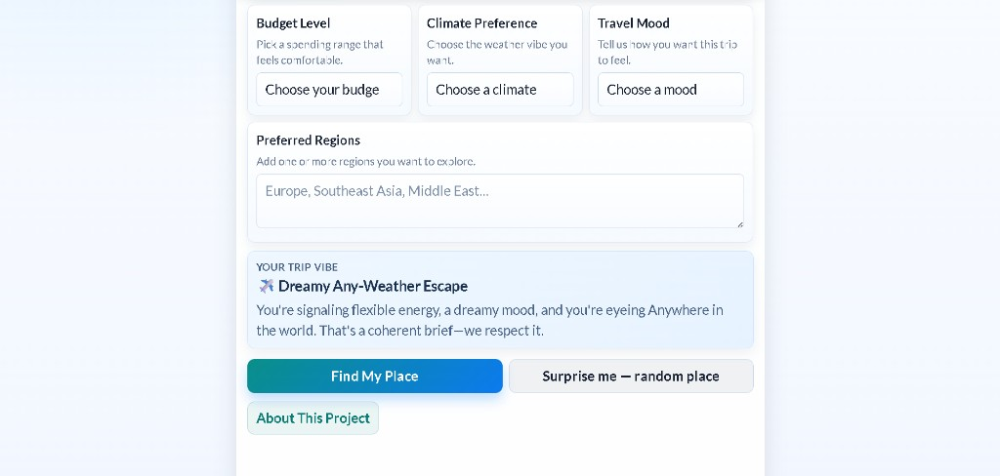

# Pick My Place

A small, static travel inspiration site: you share how you like to travel, and it ranks destinations from a curated catalog—no API keys, no backend. Everything runs in the browser.

**Live demo:** [https://modasirabakar.github.io/Pick-My-Place/](https://modasirabakar.github.io/Pick-My-Place/)

## Preview

Home page — hero and preferences:

Regions, trip vibe preview, and actions:

## What it does

- **Matcher** — Form on the home page (hobbies, budget, climate, mood, regions). Submit to get ranked destination cards with short reasons and highlights.
- **Results** — Saved in `localStorage` so you can refresh or come back to the same run (until you clear it).
- **Saved picks** — On the results page, save individual places to a shortlist that survives clearing the main list.
- **Surprise me** — Random pick from the same catalog, without using the form.
- **Copy results** — Plain-text export of your run (and saved picks when relevant) for notes or messages.
- **Gentle notes** — If hobby words or regions do not match the catalog well, the results page explains that in friendly copy.

## Tech stack

- HTML, CSS, vanilla JavaScript
- `localStorage` for results, preferences metadata, and saved picks
- Google Fonts (Lato)

## How to run locally

1. Clone or download this folder.
2. Open `index.html` in a modern browser (double-click, or use a local static server such as VS Code **Live Server**).

There is no install or build step.

## Project layout

| File / folder  | Role                                                  |
| -------------- | ----------------------------------------------------- |
| `index.html`   | Form + trip vibe preview + actions                    |
| `script.js`    | Catalog, scoring, save + redirect                     |
| `results.html` | Results layout                                        |
| `results.js`   | Render cards, picks, copy, clear                      |
| `about.html`   | How it works, creator, feature notes                    |
| `styles.css`   | Shared styling                                        |
| `favicon.svg`  | Tab icon                                              |
| `docs/`        | README preview screenshots                            |
| `DEPLOY.md`    | Replace `__PICKMYPLACE_SITE__`, Lighthouse, device QA |

## Deploy, sharing, and QA

Each HTML page includes `meta description`, **canonical** URL, **Open Graph**, and **Twitter** image tags. Before you publish, replace the placeholder `__PICKMYPLACE_SITE__` in every page with your real public origin (see **DEPLOY.md** for examples, Lighthouse steps, and a device checklist).

## Creator

**Modasir Abakar** — see `about.html` for project context.
